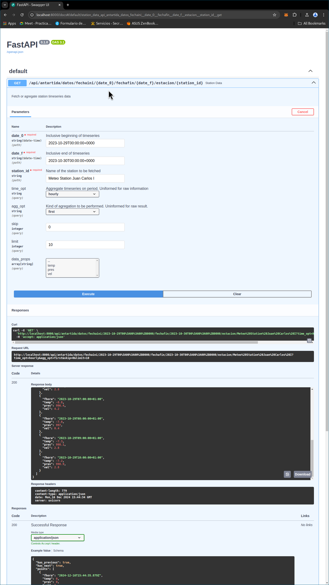

# Aemet Antartica data fetching

Fast-api based aemet-antartica data fetcher.

Usage requires amet-api-key. More information in [AEMET OpenData](https://opendata.aemet.es/centrodedescargas/inicio)



## Install

`poetry install [--all-extras]`

Recommended all extras for testing...


## Dev run

```
poetry shell
AEMET_API_KEY="<YOUR-AEMET-KEY>" fastapi dev aemetAntartica/app/app.py
```

With sql cache 
```
poetry shell
AEMET_API_KEY="<YOUR-AEMET-KEY>" AEMET_SQLITE_URL="<SQLITE-FILE:cache.db>" fastapi dev aemetAntartica/app/app.py
```

Then check your [localhost:8000/docs](http://localhost:8000/docs)

## Testing:

### Unit testing:

```
poetry shell
pytest pytest test/aemetAntartica/unitary/
```

### Integration testing:

```
poetry shell
AEMET_API_KEY="<YOUR-AEMET-KEY>" pytest test/aemetAntartica/integration/
```

This tests are done to check the different fetch implementation.


## Config:

All config options are environment-variable based:

### Required:

- AEMET_API_KEY: aemet open data api key.

### Optional:

- AEMET_FETCHER_TYPE: serial, concurrent or naive (default: serial)
- AEMET_CACHED: none or memory (default: memory)
- AEMET_DATE_GEN: month or naive (default: month)
- AEMET_STATIONS_METADATA_JSON: path to the stations metadata file (default data if none)
- AEMET_TIMEZONE_RESULT: any timezone from. See zoneinfo.available_timzone(). (default: Europe/Madrid)
- AEMET_SQLITE_URL: including sqlite cache if informed. (default data if none)

## WIP

Aspects of the application I'm not totally satisfied about.

- Include coverage tools to better control testing.
- Include hypothesis to find edge cases, specially in aggregation functions.
- Include testing done with data fetched from the aemet-opendata server for aggregation.
- Include testing over sql-cache. This could be done with a mock placeholder fetcher that let's us know if the sql cache proxy is calling this speciall fetcher.
- Do a frontend. Maybe jinja2 + tailwindcss + vegajs is enough.
- Improve on aggregation functions. This take a timedelta argument to slice in chunks. This is not adequate for months. Use a functional approach with "chunker" function over a sorted list of objects with dates.
- Make logging more consistent through the application.
- Create logging context and inject the user HTTP request ID and create a UUID for each outgoing request.
- Include timeouts for fetching operations. This has not been a problem so far but I would be to have them under control.
- Include 4XX responses on input and potentially other controlled errors.

## Questions:

### Use of metrics and alerts:

The following metrics would be specially interesting for analysis:

- AEMET api latency. For obvious it's sensitive for worst-case performance.
- Sqlite latency. Very important for a smooth user experience.
- Sqlite cache hit rate. Very important to size the cache or reduce it.
- Aggregation time. Would be used to decide if we should switch to pre-calculated or vectorized solutions.

I would alert on error except if it's caused by user wrong input.

### How to avoid unnecessary requests from data consumers if data updates happen a few times per day?

I would decouple the upstream data service from our backend.

An ETL process can run a few times a day. Airflow or Prefect may be used to this effect.

### Find ways to improve the handling of the income request of the users

Given that the data is fetched form an external API wich is out of our control I would decouple this backend from the data source as much as possibe.

The antartic opration data is updated once a year so I may even recommend doing a manual migration. This would allow us to do impute nans, would reduce the complexity of the application, would reduce fetch times to a minimum and would also eliminate a source of errors.

### What other things we could expand the service to provide more value to the user?

The most obvious step forward would be to provide intelligence over the data.

This information could be correlated for forecasting or we could try to use different stations to infer what may be happening elsewhere if there is data available.

### How should we do AuthZ/AuthN? What trade-offs do you see?

For authentication I would use either a FastApi middleware or a full blown [proxy](https://oauth2-proxy.github.io/oauth2-proxy/) depending on the requirements.

Proxies are good for drop-in when the whole application must authenticated. This may be mitigated by using combining it with a reverse proxy and authenticating only some routes. The advantage of this approach is that it leaves much less room for human error, it may be included potentially anywhere and it can be implemented "orthogonally" (without either the client or the server knowing it's there).

Middleware may be more straight forward and flexible for developers.

The main benefit of including authentication would be to prevent leaking of information, improvement of metrics data since we now have more information about how the application is used and it would allow us to provide different functionality in the future. The tradeoffs would be the increase in complexity of the application. If done right there should be no tradeoffs if done right.

I personally have a hard time seeing the point aside from selling the potential results of the analysis as a api-service.
